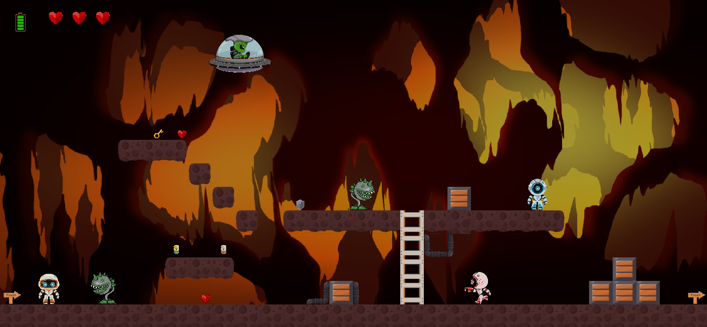

<h1>Platformer game</h1>

   Цей проєкт створено з метою ознайомлення з модулем для створення ігор pygame, основною метою проєкту було розібратися з створенням логіки власної гри, навчитись логічно продумувати кожен ігровий процес та розробляти його за допомогою коду.

<h3>Основні модулі проєкту:</h3>
<ul>
    <li><b>pygame</b> - Основний модуль для створення ігор в python</li>
    <li><b>os</b> - Модуль для роботи з файловою системою та шляхами до файлів</li>
    <li><b>pytmx</b> - Модуль для створення карти з тайлів</li>
</ul>

<h3>Структура проєкту:</h3>
<ul>
    <li><b>manage.py</b> - Головний файл, запуску проєкту</li>
    <li><b>modules</b> - Папка з усіма python файлами</li>
    <li><b>characters</b> - Папка з усіма файлами, що стосуються персонажів</li>
    <li><b>images</b> - Папка з зображеннями</li>
    <li><b>tilemaps</b> - Папка з картами рівнів</li> 
    <li><b>start.py</b> - Файл, у якому створено функцію запуску</li>
    <li><b>settings.py</b> - Файл з налаштуваннями проєкту</li>
    <li><b>item.py</b> - Файл, у якому створено клас для предметів, що можна збирати</li>
    <li><b>map.py</b> - Файл, у якому створено ігрову карту</li>
    <li><b>image.py</b> - Файл, у якому створено клас для роботи із зображеннями</li> 
    <li><b>character.py</b> - Файл, у якому прописано клас, від якого успадковуються всі персонажі</li>
    <li><b>hero.py</b> - Файл для створення головного героя</li>
    <li><b>friendly_bot.py</b> - Файл для створення мирного персонажу</li>
    <li><b>enemy.py</b> - Файл для створення ворога, що стріляє</li>
    <li><b>plant_enemy.py</b> - Файл для створення ворога рослини, що кусає персонажа</li>
    <li><b>fly_enemy.py</b> - Файл для створення ворога, який літає та кидає бомби</li>
</ul>

<h3>Запуск проєкту:</h3>

Для запуску проекту необхідно виконати такі кроки:

+ Встановлення ресурсів:
    - <b>Python</b> - Головна мова програмування, якщо вона не встановлена потрібно встановити <a href = "https://www.python.org/downloads/">Download</a>
    - <b>Git</b> - Основний ресурс для контролю версій проєкту, на якому його й збережено <a href="https://git-scm.com/downloads">Download</a>
+ Встановлення та підготовка проєкту:
    - <b>Встановлення проєкту</b> - В терміналі виконайте команду: `git clone посилання_на_репозиторій`
    - <b>Встановлення модулів</b> - Для роботи проекту необхідно встановити 2 модулі, команда - `pip install pygame pytmx`
+ Для запуску проєкту, запустіть файл manage.py. Або в терміналі напишіть команду: `python manage.py`
